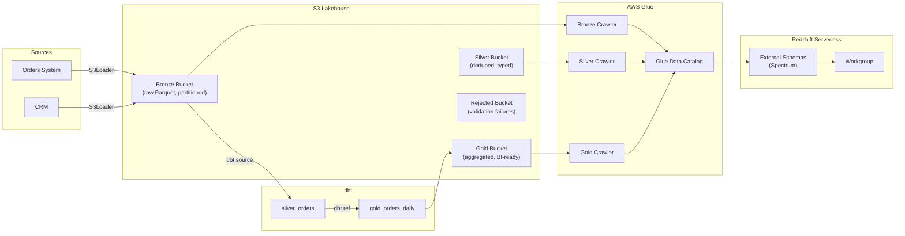

# Medallion AWS Kit

**Zero to lakehouse in 30 minutes** — a production-ready Medallion Architecture
starter kit for AWS built with Terraform, dbt, and Python.

---

## Architecture



### Layer Responsibilities

| Layer | Storage | Transformation | Materialization |
|-------|---------|---------------|----------------|
| **Bronze** | Raw Parquet, append-only | None | S3 + Glue external table |
| **Silver** | Typed, deduplicated Parquet | Dedup, type cast, boolean normalize | dbt `table` |
| **Gold** | Aggregated Parquet | Business aggregations, joins | dbt `incremental` |

---

## Quickstart (30 minutes)

### Prerequisites

| Tool | Version |
|------|---------|
| Terraform | ≥ 1.5 |
| Python | ≥ 3.11 |
| dbt-redshift | ≥ 1.7 |
| AWS CLI | configured with appropriate permissions |

### 1. Clone and install

```bash
git clone <your-repo>
cd medallion-aws-kit

# Install Python dependencies
pip install -e ".[dev,dbt]"
```

### 2. Configure your environment

```bash
# Copy and edit the Terraform vars
cp terraform/environments/dev/terraform.tfvars terraform/environments/dev/terraform.tfvars.local
# Edit prefix, subnet_ids, security_group_ids

# Copy and edit dbt profiles
cp dbt/profiles.yml.example ~/.dbt/profiles.yml
# Fill in your Redshift endpoint

# Set the Redshift admin password
export TF_VAR_redshift_admin_password="<your-password>"
```

### 3. Bootstrap everything

```bash
chmod +x scripts/bootstrap.sh
./scripts/bootstrap.sh --env dev
```

This single command:
1. Runs `terraform init → plan → apply` for the dev environment
2. Creates all S3 buckets, IAM roles, Glue databases/crawlers, and Redshift Serverless
3. Runs `dbt deps → dbt run → dbt test`
4. Runs the Python test suite

### 4. Load your first data

```python
from ingestion import S3Loader
from datetime import date

loader = S3Loader(
    bucket_name="myco-lakehouse-bronze",
    source_system="orders_system",
    entity="orders",
)

# Upload a local file
loader.upload_file("path/to/orders.parquet", partition_date=date.today())

# Or upload a DataFrame
import pandas as pd
df = pd.read_csv("orders.csv")
loader.upload_dataframe(df)
```

### 5. Trigger the Glue crawler

```python
from ingestion import GlueCrawlerTrigger

trigger = GlueCrawlerTrigger("myco-lakehouse-bronze-crawler-dev")
result = trigger.run()   # blocks until done; raises CrawlerFailedError on failure
print(result)
```

### 6. Run dbt transformations

```bash
cd dbt
dbt run --select silver_orders
dbt run --select gold_orders_daily
dbt test
```

---

## Module Reference

### Terraform Modules

#### `modules/s3_lakehouse`

Creates and configures all S3 buckets.

| Variable | Type | Description |
|----------|------|-------------|
| `prefix` | string | Project prefix (e.g. `myco-lakehouse`) |
| `environment` | string | `dev` or `prod` |
| `lakehouse_role_arn` | string | ARN of the IAM role allowed to access buckets |

Outputs: `bucket_arns`, `bucket_names` (maps of layer → ARN/name)

#### `modules/iam_roles`

Creates three least-privilege IAM roles.

| Role | Trust | Permissions |
|------|-------|------------|
| `glue_role` | Glue service | S3 R/W all layers + AWSGlueServiceRole |
| `redshift_role` | Redshift service | S3 read bronze/silver/gold + Glue read |
| `pipeline_role` | Lambda/ECS | S3 R/W bronze only + Glue StartCrawler |

#### `modules/glue_catalog`

Creates Glue databases and crawlers for each layer.

| Layer | Database | Crawler schedule |
|-------|---------|----------------|
| Bronze | `{prefix}_bronze_db` | Every 30 minutes |
| Silver | `{prefix}_silver_db` | On-demand |
| Gold | `{prefix}_gold_db` | On-demand |

#### `modules/redshift_serverless`

Creates a Redshift Serverless namespace and workgroup.

| Variable | Default | Description |
|----------|---------|-------------|
| `base_capacity_rpu` | 8 | RPUs (8 dev, 32 prod) |
| `admin_username` | `admin` | Admin user |
| `db_name` | `lakehouse` | Default database name |

---

## dbt Macro Reference

### `deduplicate(relation, unique_key, order_by)`

Generates a `ROW_NUMBER()`-based deduplication CTE.

```sql
{{ deduplicate(
    source('bronze_orders', 'orders'),
    ['order_id', 'source_system'],   -- composite unique key
    '_raw_timestamp DESC'            -- latest record wins
) }}
```

### `standardize_boolean(column)`

Converts messy boolean strings to SQL `BOOLEAN`.

```sql
{{ standardize_boolean('is_paid') }} as is_paid
-- 'true','1','yes','y' → TRUE
-- 'false','0','no','n' → FALSE
-- NULL or other       → NULL
```

### `add_metadata_columns(source_system_col, ingested_at_col, business_cols)`

Appends mandatory silver metadata columns.

```sql
{{ add_metadata_columns(
    source_system_col='source_system',
    ingested_at_col='_raw_timestamp',
    business_cols=['order_id', 'customer_id', 'total_amount']
) }}
-- Appends: _ingested_at, _updated_at, _source_system, _row_hash
```

### `not_null_proportion` (generic test)

Fails if non-null proportion is below threshold.

```yaml
- name: customer_id
  tests:
    - not_null_proportion:
        min_proportion: 0.99
```

---

## Onboarding a New Data Source

Follow these 6 steps to onboard a new entity end-to-end:

### Step 1 — Configure the ingestion pipeline

Choose a `source_system` and `entity` name following `naming_conventions.md`.
Update your pipeline code to use `S3Loader`:

```python
loader = S3Loader(
    bucket_name="myco-lakehouse-bronze",
    source_system="crm_system",   # new source
    entity="customers",           # new entity
)
loader.upload_dataframe(customers_df)
```

### Step 2 — Register the source in dbt

Add an entry to `dbt/models/bronze/sources.yml`:

```yaml
- name: bronze_customers
  schema: bronze_spectrum
  tables:
    - name: customers
      external:
        location: "s3://{BRONZE_BUCKET}/crm_system/customers/"
        file_format: parquet
        partitioned_by:
          - name: year
            data_type: varchar(4)
          - name: month
            data_type: varchar(2)
          - name: day
            data_type: varchar(2)
```

### Step 3 — Create the silver model

Create `dbt/models/silver/silver_customers.sql`:

```sql
with deduped as (
    {{ deduplicate(
        source('bronze_customers', 'customers'),
        ['customer_id', 'source_system'],
        '_raw_timestamp DESC'
    ) }}
),
typed as (
    select
        customer_id::varchar(64)  as customer_id,
        email::varchar(255)       as email,
        -- ... other typed columns
        source_system, _raw_timestamp, year, month, day
    from deduped
),
final as (
    select
        customer_id, email, source_system, year, month, day,
        {{ add_metadata_columns(
            source_system_col='source_system',
            ingested_at_col='_raw_timestamp',
            business_cols=['customer_id', 'email']
        ) }}
    from typed
)
select * from final
```

### Step 4 — Add schema tests

Create/update `dbt/models/silver/schema.yml`:

```yaml
- name: silver_customers
  columns:
    - name: customer_id
      tests: [not_null, unique]
    - name: email
      tests:
        - not_null_proportion:
            min_proportion: 0.95
```

### Step 5 — Build and test

```bash
cd dbt
dbt run --select silver_customers
dbt test --select silver_customers
```

### Step 6 — Create the gold model (if needed)

Create `dbt/models/gold/gold_customers_monthly.sql` following the
incremental pattern in `gold_orders_daily.sql`.

---

## Running Tests

```bash
# Python unit tests (with coverage)
pytest tests/ -v

# dbt tests
cd dbt && dbt test

# Full suite via bootstrap
./scripts/bootstrap.sh --skip-terraform
```

---

## Project Layout

```
medallion-aws-kit/
├── terraform/           Terraform modules and environments
├── dbt/                 dbt project (macros, models, tests)
├── ingestion/           Python ingestion layer
├── conventions/         Team conventions and reference docs
├── scripts/             Bootstrap and utility scripts
├── tests/               Python unit tests
└── pyproject.toml       Python packaging and tooling config
```

---

## Security Notes

- All S3 buckets have public access blocked and AES256 encryption enabled.
- IAM roles follow least-privilege — no wildcard resource ARNs.
- Never commit `terraform.tfvars.local`, `~/.dbt/profiles.yml`, or `.env` files.
- Use `TF_VAR_redshift_admin_password` env var — never hardcode secrets.
- The pipeline IAM role has write access to bronze only — silver and gold
  are written exclusively by dbt running under controlled CI.
